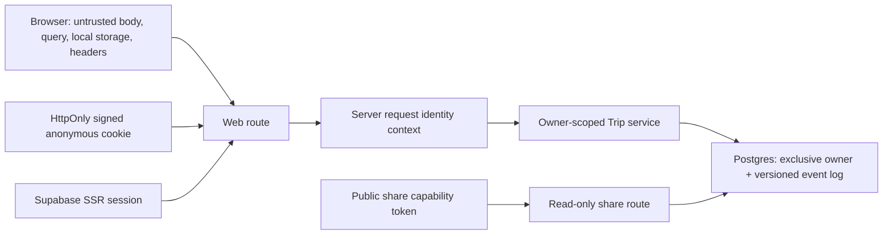

# ADR-0004: Server-verified identity, Trip ownership, sharing, and concurrency

Date: 2026-07-11
Status: Accepted
Deciders: operator / architecture owner
Owner: security and architecture owner
Review date: before the merge of #112 or #113, and at the next security architecture review no later than 2026-08-11

## Context and Observed Deviation

The current Web and server routes accept `userId`, `anonId`, `email`, and sometimes `currentTrip` from
client-controlled input. Existing Trip persistence can update a stored Trip without proving that the
request identity owns it. This is a D2 object-level authorization deviation: a caller can attempt to
read, claim, share, or overwrite another caller's Trip.

The product requires anonymous planning before login and durable Trip continuity after login. That
requirement does not justify a client-chosen authorization identifier.

## Decision

### 1. One Server Request Identity

Every request receives exactly one authoritative identity context from trusted server code:

| Context | Authoritative source | Can own a Trip | Notes |
| --- | --- | --- | --- |
| `anonymous` | server-issued signed anonymous session cookie | yes | No Supabase anonymous sign-in is used. |
| `authenticated` | verified Supabase Auth SSR session user id | yes | Email is display metadata, never authorization. |
| `none` | no verified credential | no | May read public POI/guide and public share only. |
| `operator` / `editor` / `admin` | verified authenticated user plus server/RLS role check | not by implicit traveler access | Defined by the separate Ops RBAC baseline. |

Request body, query string, localStorage, custom client header, `email`, `userId`, `anonId`, owner
object, and `currentTrip` are non-authoritative. They MUST NOT select an owner or grant access.

### 2. Anonymous Session Contract

The server creates an opaque anonymous identifier from at least 256 bits of cryptographic randomness
and sends it only in an HttpOnly cookie. The production cookie uses `Secure`, `SameSite=Lax`, `Path=/`,
no `Domain`, and a rolling maximum age of 30 days. Development may omit `Secure` only on localhost.

The cookie value is versioned and HMAC-signed using server-only key material, for example:

```text
v1.<base64url opaque anonymous id>.<key id>.<base64url HMAC>
```

It contains no email, user id, Trip id, or other personal data. The server accepts only the active
signing key and one previous key during rotation. Invalid, expired, or malformed cookies are treated
as a new anonymous session without disclosing validation detail. Cookie values and signing keys are
never logged.

### 3. Supabase Auth SSR Contract

Authenticated identity is the verified Supabase user id returned by server-side session validation.
The server refreshes/clears auth cookies through the approved SSR flow. It does not trust a decoded
client claim or `user_metadata` for authorization. Login, logout, token refresh, and expired-session
paths rebuild the same request identity context before any Trip operation.

When both a verified user and a valid anonymous cookie exist, the effective owner for ordinary
authorized reads/writes is the verified user. The anonymous id is available only to the controlled
claim operation.

### 4. Trip Ownership and Claim

A persisted Trip has exactly one owner: either `owner = authenticated user id` or `anon_id = signed
anonymous session id`. A follow-up migration MUST replace the current at-least-one-owner check with a
mutually-exclusive owner check. A Trip never changes owner through a general save operation.

| Operation | Required server identity | Result |
| --- | --- | --- |
| create | authenticated or anonymous | Server assigns exactly one owner. |
| get/list/save/delete | matching effective owner | Non-owner and absent Trip both return non-enumerating `404`. |
| claim | verified user plus current signed anonymous id | Atomically transfers only rows currently owned by that anonymous id; sets `owner`, clears `anon_id`; idempotent. |
| share/revoke | matching effective owner | Creates or removes a public read-only capability token. |
| public share read | valid active token | Returns only the safe Trip share projection; never grants mutation. |

Claim does not accept an arbitrary `anonId` or `userId`. Existing localStorage anonymous identifiers
have no server-verifiable provenance and are not automatically migrated or claimed. Legacy demo data
may be discarded or regenerated rather than converted into an authorization credential.

### 5. Public Share Capability

Share tokens are server-generated, opaque, cryptographically random values with at least 128 bits of
entropy. A token grants read-only access to one Trip projection and never to user profile, Human Task,
payment, trace, preference, internal note, or mutation endpoint. Only the owner can create or revoke
it. Revocation clears the active token immediately; an invalid/revoked token returns `404`.

Public share responses set a restrictive referrer policy and are excluded from search indexing unless a
future explicit product decision changes that policy. A Trip has at most one active token; rotation is
revoke then create, not token reuse across Trips.

### 6. Optimistic Concurrency and Event Integrity

Every existing-Trip mutation requires `expectedVersion`. The persistence transaction conditionally
updates the snapshot only when all three conditions match: Trip id, effective owner, and current
`head_version`. It appends the next event and updates the snapshot in the same transaction.

- `head_version` starts at `0`; the first non-empty event is version `1`.
- A stale write returns `409 TRIP_VERSION_CONFLICT` with safe current-version metadata; the client
  re-reads through its owner-scoped route before retrying.
- An authorization failure returns non-enumerating `404`; missing identity returns `401` where a
  private operation requires identity.
- P0-10 adds idempotency keys for asynchronous completion. Until then, retries must not bypass the
  version check.
- All Trip state changes remain deterministic `TripPatch` application; a client or model never sends a
  replacement snapshot as authority for an existing Trip.

### 7. Frozen Interface Consequences

P0-03 (#112) owns the Supabase SSR/session implementation and server request identity context.
P0-04 (#113) owns owner-scoped Trip APIs, exclusive-owner migration, conditional save, BOLA coverage,
and removal of client-provided owner/currentTrip authority. Consumers must not implement alternate
identity parsing or owner checks.

## Trust Boundary and Threat Matrix



| Threat | Required control | Expected safe result |
| --- | --- | --- |
| Forged `userId`, `anonId`, email, owner, or `currentTrip` | Ignore them for authorization; derive identity server-side | No access or mutation beyond the caller's context |
| Cookie tampering or fixation | HMAC verification, opaque random id, HttpOnly/Secure/SameSite flags, key rotation | New anonymous session or `401`; no claimed Trip access |
| User/Trip id enumeration | Owner-scoped queries and non-enumerating `404` | Caller cannot distinguish another owner's Trip from absence |
| Concurrent stale mutation | Conditional owner/version update and event append in one transaction | `409 TRIP_VERSION_CONFLICT`; no silent overwrite |
| Claiming another anonymous visitor's Trip | Claim uses only the current signed anonymous session and verified user | No arbitrary anonymous id transfer |
| Leaked or revoked share link | Opaque high-entropy token, read-only projection, revocation, noindex/referrer policy | At most read access until revoked; no private data or mutation |
| Service-role/direct-table bypass | Server context plus RLS/least privilege from the data boundary | No public client path gains broad database access |

## Required Test Matrix

P0-03 and P0-04 must add reproducible tests for:

1. anonymous cookie issuance, tampering, expiry, rotation, and no credential logging;
2. authenticated session refresh, logout, and expired session;
3. forged body/query `userId`, `anonId`, `email`, and `currentTrip` having no authorization effect;
4. user A versus user B and anonymous A versus anonymous B read, save, claim, share, and revoke BOLA
   cases;
5. idempotent claim, owner exclusivity, and legacy unsigned-id rejection;
6. stale `expectedVersion`, concurrent write, event/version uniqueness, and no silent overwrite;
7. valid, invalid, revoked, and rotated public share token behavior.

## Alternatives Considered

- **Client localStorage UUID as anonymous owner:** rejected because callers can forge or copy it.
- **Supabase anonymous sign-in:** rejected for Phase 0 because server-signed anonymous continuity meets
  the product need without creating unauthenticated Auth users or broadening Auth/RLS complexity.
- **Allow `userId` input while checking it later:** rejected because every route would retain a
  confused-deputy risk.
- **Last-write-wins Trip save:** rejected because it silently discards itinerary changes.
- **Public share with editable capability:** rejected because it changes the product and multiplies
  authorization risk.

## Consequences, Observation, and Rollback

The next implementation PRs must make legacy client identity input invalid or ignored. This can require
an honest reauthentication/regeneration path for demo data. The release gate observes BOLA test
coverage, `401/404/409` rates, claim success/failure, cookie-validation failures, and share revocation
behavior. Any evidence that changes the ownership, token, cookie, or concurrency model is D2 and
requires an ADR amendment or supersession.

If the implementation fails, disable private Trip mutation/claim/share behind an honest unavailable
state while retaining public content. Do not restore client-supplied ownership as a rollback shortcut.
