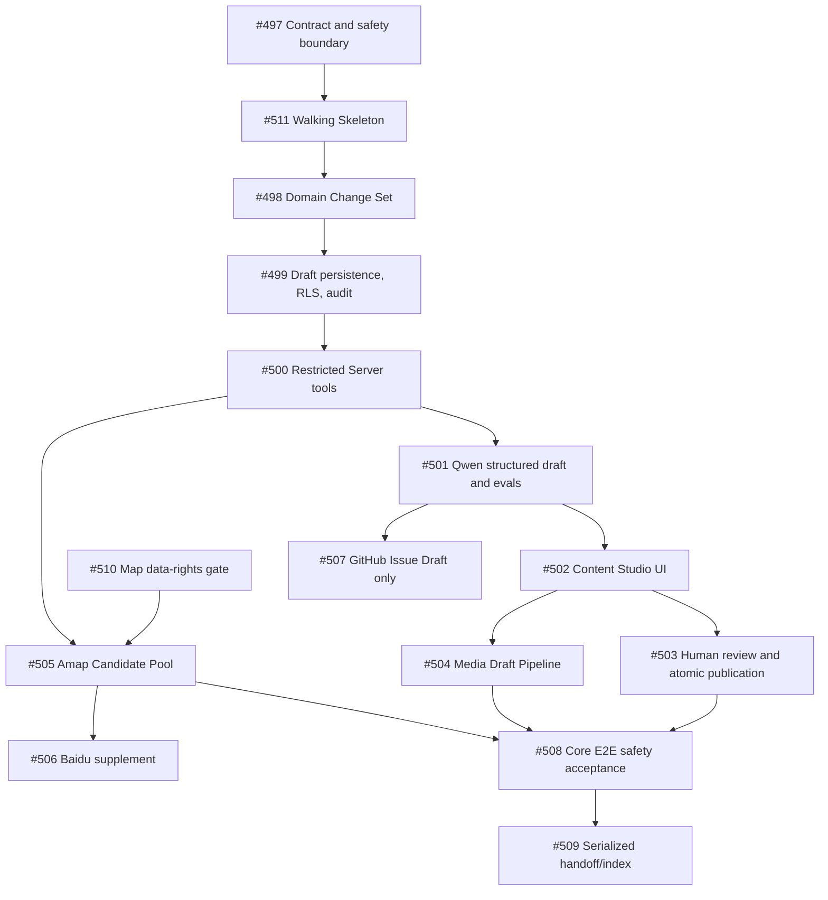

# Content AI v1 Current State, Gaps, and Dependency Map

Status: active
Owner: knowledge / operations / AI safety
Program: [#496](https://github.com/JTCAO515/VP-Final/issues/496)

## Control Objective

Let an authorized content worker transform fragmented, source-backed material into a structured
private proposal without giving the model authority to publish facts, access secrets, or change
program behavior. A human must see a typed Diff and explicitly approve every formal publication.

## Current State

| Existing foundation             | Reuse in Content AI                                                                         | Deliberate limit today                                                                 |
| ------------------------------- | ------------------------------------------------------------------------------------------- | -------------------------------------------------------------------------------------- |
| Domain knowledge schemas        | POI, facts, evidence/source classes, eligibility, local-display facts, canonical POI writes | No Change Set or operation-level version contract                                      |
| Knowledge service and Ops Facts | POI/fact create/update, individual review, expiry/deprecation, same-POI context             | No conversational draft composition or transactional multi-operation publish           |
| Bulk fact import                | private batches, dry-run/commit, idempotent audit, all facts remain draft                   | CSV-only; no provider candidate pool or AI conflict summary                            |
| Ops authorization               | fixed roles, verified request identity, atomic audit, revocation                            | No contributor-owned Content AI workspace mapping                                      |
| Private POI images              | server-mediated Storage, signature checks, EXIF removal, attribution/license, soft delete   | No media draft review model or public delivery                                         |
| AI package and Server router    | safe adapter, structured parse/repair pattern, cost/attempt metadata                        | No Content AI model route, tool protocol, prompt-injection fixture, or model authority |
| Ops audit ledger                | minimized sensitive mutation evidence                                                       | No append-only Change Set/publication audit contract                                   |

## Gaps and Frozen Responses

| Gap                                                       | Failure if ignored                           | Frozen response                                                  | First owner |
| --------------------------------------------------------- | -------------------------------------------- | ---------------------------------------------------------------- | ----------- |
| UI cannot validate a purely layered schema                | late Diff/conflict redesign                  | walking skeleton before broad schema                             | #511        |
| Model could invent POI IDs or treat observations as truth | duplicate/misbound POIs and fabricated facts | program retrieves; model only ranks bounded candidates           | #497, #500  |
| Multi-operation publish may partially apply               | invisible content corruption                 | all-or-nothing transaction and human rebase                      | #511, #503  |
| External documents can inject instructions                | contaminated draft text/tool intent          | fixed-delimited untrusted context and evals                      | #501        |
| Map terms could prohibit retained data                    | unusable or unlawful import system           | official-terms gate before candidate persistence                 | #510        |
| Existing image writer is private only                     | accidental public/copyright exposure         | retain ADR-0021; media stays draft/private                       | #504        |
| Roles have no content-draft ownership rule                | cross-contributor data leakage               | contributor owns own drafts; privileged access is server-checked | #499        |

## Dependency Graph

## Scope and Anti-goals

The first safe loop is #497, #511, #498 through #505, and #508. Issue #510 is a separate legal/data-rights
gate for all map-candidate persistence. The loop does not create travel content,
call a real provider without recorded external evidence, activate public image delivery, copy map
images, create GitHub Issues, or bypass reviewed fact eligibility. Baidu and GitHub Issue Draft
refinement follow the core loop.

## Walking Skeleton Observation Contract

Issue #511 intentionally uses one test-only `local_address_nearest_metro_exit` operation against a
seeded canonical POI. It persists a private owner-scoped draft, previews before/after/evidence/risk and
the expected fact version, then uses the existing reviewed-fact evidence gate and one database
transaction to publish both the fact and its audit record. The fixture route is unavailable outside the
test runtime, so it cannot create hardcoded travel content in production.

The slice confirms that fact-level optimistic locking exists, but POIs themselves do not currently carry
a version. CONTENT-AI-02 MUST decide the generic POI version/concurrency contract before it promises
POI-field operations. It also confirms that the current fixed Ops roles have no Contributor role; the
full draft-ownership/RLS mapping remains a CONTENT-AI-03 decision rather than an implicit role change in
this probe.

## Rollback

Disable the Content AI route or remove its server-only configuration. Drafts are cancelled or retained
privately under their configured retention; published content follows its existing forward
review/revocation path. No rollback may convert AI output into public fact or make private media public.
