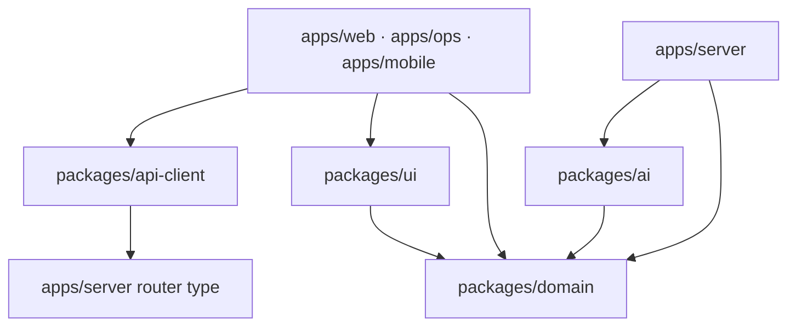

# Dependency Rules

## Allowed Direction

Not every allowed arrow is implemented yet. An arrow permits a dependency; it does not require one.

## Package Rules

| Source | May depend on | Must not depend on |
| --- | --- | --- |
| `packages/domain` | Zod and language/runtime primitives | Any app, server, UI, database, provider SDK |
| `packages/ai` | Domain contracts and provider-neutral utilities | Web/Ops/Mobile, database tables, framework UI |
| `packages/ui` | Domain display types where necessary | App routes, server DB, provider SDKs |
| `apps/server` | Domain, AI, database adapters, server libraries | Web/Ops/Mobile page or component files |
| `packages/api-client` | Exported server router type and domain types | Server persistence implementations or app UI |
| `apps/web` | Domain, UI, API/server facade | Ops or Mobile internals |
| `apps/ops` | Domain, UI, protected server services | Web or Mobile internals |
| `apps/mobile` | Domain, UI, API client | Next.js app internals or direct database access |

## Server Module Rules

- A module owns its service interface and behavior.
- Routers validate transport input and delegate to services; they do not contain persistence logic.
- Cross-module calls use exported service interfaces supplied through server context.
- A module must not import another module's database tables to bypass its service.
- Shared domain behavior moves to `packages/domain`; shared backend orchestration stays in an
  explicitly named server service.
- In-memory adapters are allowed only for tests and explicit demo mode.

## Contract Rules

- Domain enums and schemas are imported from `@visepanda/domain`.
- Public package consumers use declared exports, not arbitrary deep imports.
- Breaking schema changes land in a standalone domain PR before consumer changes.
- Database schema and domain schema may use different representations, but adapters must parse the
  resulting domain object before returning it.
- API responses cross a runtime validation boundary before reaching UI state.

## Verification

- `apps/server/src/modules/boundary.test.ts` protects selected server boundaries.
- `pnpm typecheck` catches type-level dependency and contract drift.
- Module changes update the corresponding module doc; `pnpm docs:impact` enforces the mapping.
- New boundary rules require tests or static checks before they are described as enforced.
