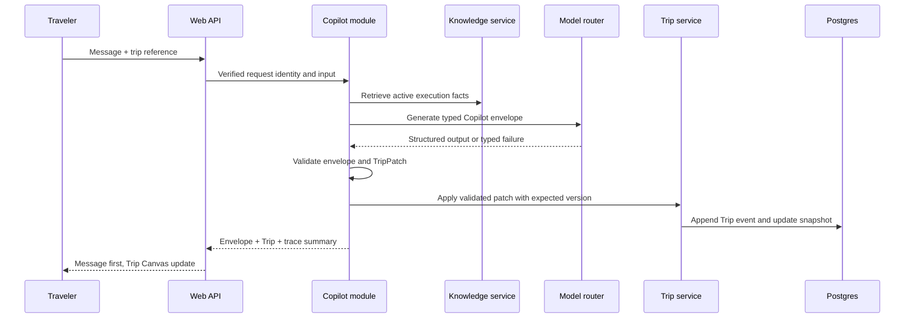
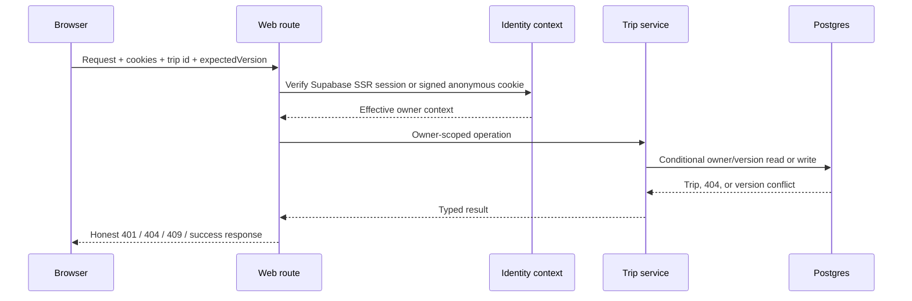
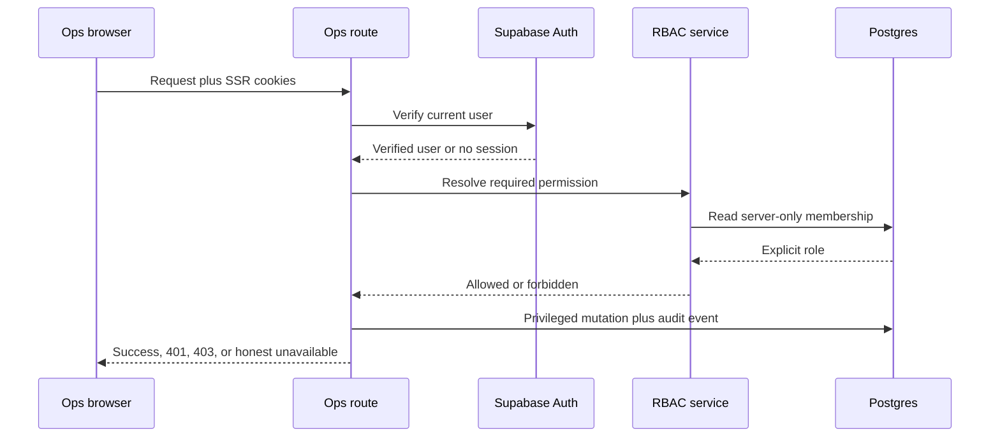
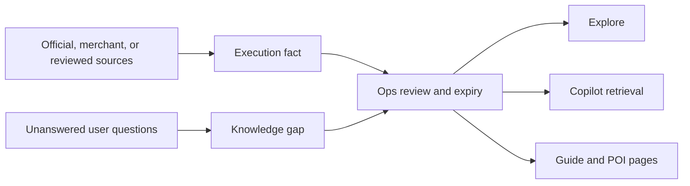

# Runtime and Data Flows

## Copilot and Trip Flow

The current implementation validates the envelope, obtains the owner-scoped snapshot on the server,
and creates or applies TripPatch values through optimistic concurrency. Intent routing, retrieval,
generation, and day completion still have deterministic defaults. Public release requires real
Supabase evidence, real provider routing, durable tracing, and honest failure behavior.

Before a Web caller is created, the composition root resolves the explicit runtime mode and durable
database availability once. Deployed Trip/Knowledge requests use Postgres or return 503
`RUNTIME_UNAVAILABLE`; transient failure never switches the selected adapter. Explicit tests inject
their services, while `local-demo` alone may cache a labelled memory pair.

## Identity and Trip Authorization Flow

Client-supplied `userId`, `anonId`, email, owner, and `currentTrip` cannot authorize a request.
Anonymous claim requires both the verified user and current signed anonymous session. Share tokens are
public read-only capabilities. The binding contract is [ADR-0004](../adr/ADR-0004-identity-trip-ownership-security.md).

## Ops Authorization Flow

Roles are non-hierarchical and never come from email, user-editable metadata, request bodies, or
navigation state. Missing Auth/database configuration fails closed. The first Admin exists only after
the registered OA-010 trusted-console bootstrap.

## Two-Pass Trip Generation

1. The first pass returns a Trip skeleton quickly.
2. The UI renders the skeleton and a generation state.
3. A silent second pass fills empty days; it does not create a second chat message.
4. Each completed day becomes a validated patch.
5. A durable completion job is unique per accepted Trip/base version and carries a job id plus
   idempotency key so retries cannot duplicate blocks.
6. Partial failure preserves valid completed work and exposes a retryable state.

## Knowledge Flow

Only reviewed, source-backed, non-expired facts whose verification time is not in the future may reach
public consumers. `source`, confidence, verification time, expiry, status, and version are part of the
fact contract. A low-evidence answer must say that the system does not know.

## Human Task Flow

1. A traveler or Copilot creates a draft request.
2. The traveler reviews and submits it; no task is created silently.
3. Ops triages the task and may quote a price.
4. Payment evidence moves the task to paid; status alone is insufficient evidence.
5. An operator fulfils the task, records evidence, and closes or cancels it.
6. Safe transcript patterns may create knowledge-gap drafts after redaction and review.

The current Web and Ops task paths are not yet one durable production flow. Until persistence,
identity, and role checks are complete, the UI must not claim production concierge fulfilment.

## Outbound Commercial Flow

1. A commerce-intent response or relevant execution surface requests a partner action.
2. The server checks partner status, category, city, and host allowlist.
3. The UI shows an adjacent disclosure.
4. The click goes through the outbound gateway and receives a click id.
5. The gateway writes the click ledger and redirects to the approved host.
6. Partner reports are reconciled later; a click is not revenue.

Raw partner URLs are forbidden in product code. Pending or inactive partners must not be visible or
redirectable.

## Telemetry Flow

Telemetry accepts only registered action names and allowlisted properties. Event failures must not
break the primary user action. Contact details, raw prompts, model secrets, and unrestricted payloads
must not enter analytics. Commercial and payment ledgers remain authoritative even when a matching
telemetry event is missing.
