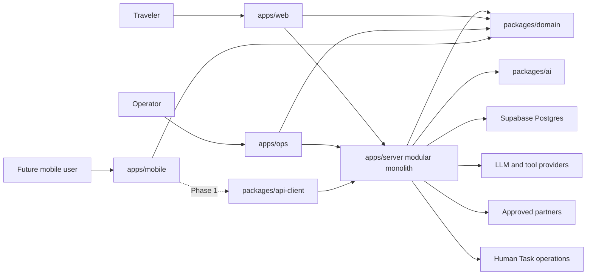

# System Overview

## Purpose

VisePanda helps foreign travellers execute a trip in China. The system turns a user request into a
typed Copilot response, applies validated TripPatch values, serves source-backed execution facts,
and routes selected commercial or human-help actions through auditable boundaries.

## Architecture Shape

The accepted Fable-5 shape is a TypeScript monorepo and modular monolith. Web and Ops currently run
as Next.js applications. Shared domain rules, server modules, model routing, API types, and UI
primitives live in workspace packages. Supabase Postgres is the durable data platform; Expo Mobile
is intentionally a Phase 1 placeholder.

## System Invariants

1. `packages/domain` is the only source of domain schemas and deterministic state functions.
2. Models return a typed Copilot envelope; they never write user data directly.
3. Trip changes use TripPatch and deterministic application before persistence.
4. Server modules communicate through explicit services, not cross-module table access.
5. Missing or stale execution evidence is shown as unknown; the product never invents facts.
6. Commercial actions require an explicit commerce intent, disclosure, approved partner, outbound
   gateway, and ledger or telemetry record.
7. Money movement requires a durable ledger. A UI state or task status alone is not payment proof.
8. Production must fail honestly when a required database or provider is unavailable.

The enforceable versions of these rules live in [architecture](../constraints/architecture.md),
[business](../constraints/business.md), [permission](../constraints/permissions.md), and
[deployment](../constraints/deployment.md) constraints.

## Product Surfaces

| Surface | Responsibility | Current state |
| --- | --- | --- |
| Web | Copilot workspace, Trip Canvas, Explore, guides, public POI pages, Human Help, share pages | Demonstrable; several paths still use deterministic or in-memory adapters |
| Ops | Fact editing, knowledge gaps, Human Task queue | Demonstrable; authentication and complete persistence are release blockers |
| Server | Copilot, Trip, knowledge, task, telemetry modules and DB adapters | Module boundary exists; production adapters are incomplete |
| Mobile | Execute-stage Today, Tools, Help, and offline package | Placeholder; Phase 1 only |

## Data Domains

- Identity: users, verified sessions, anonymous session ownership, operator roles.
- Trip: materialized Trip snapshots and append-only Trip events.
- Knowledge: POIs, execution facts, commercial links, and knowledge gaps.
- AI trace: model attempts, tool calls, cost, latency, and safe replay metadata.
- Commerce: partners, outbound clicks, entitlements, payments, and reconciliation.
- Human operations: Human Tasks, status transitions, quotes, evidence, and transcripts.
- Telemetry: allowlisted events used to calculate activation, trust, and commercial funnels.

## Deployment Topology

Phase 0 keeps runtime topology small:

- Public Web: one Vercel project.
- Protected Ops: a separate Vercel project and access boundary.
- Server modules: compiled into the relevant Next.js runtime until Mobile requires a stable external
  endpoint.
- Data: Supabase Postgres migrations under `infra/supabase`.
- Durable background work: introduced only for slow or retryable flows such as second-pass Trip
  completion.

Microservices, Kubernetes, a separate API gateway, and independent named AI agents are explicit
anti-goals until measured scale requires them.
