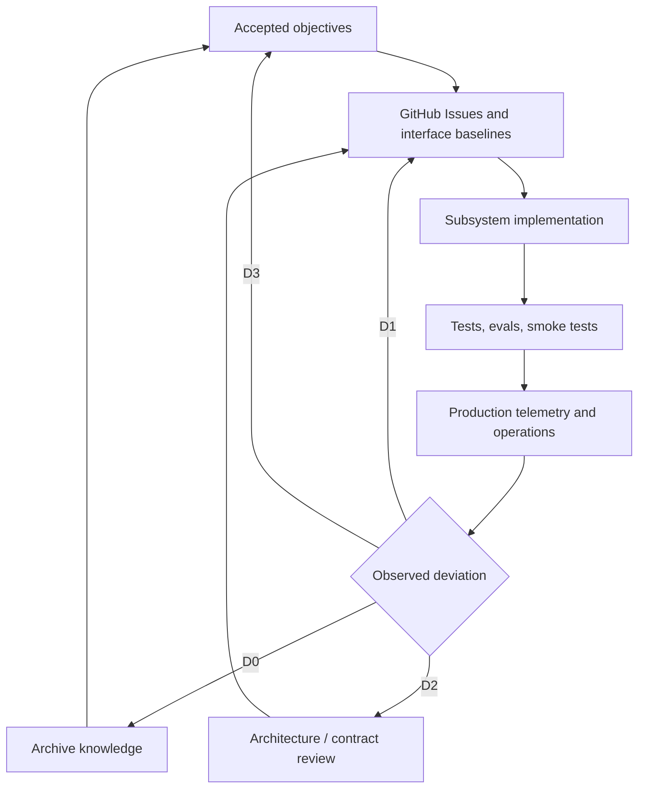

# VisePanda Overall Design Baseline

Status: active
Method: [钱学森 Skills](../methodology/qian-systems-engineering.md)
Product authority: [V2 frozen baseline](../planning/visepanda-v2-final-architecture.md), amended by [ADR-0023](../adr/ADR-0023-chatbot-execution-core.md), [ADR-0024](../adr/ADR-0024-planning-execution-workspace.md), the [ADR-0025 V3 experience-layer boundary](../adr/ADR-0025-vp-v3-web-experience-layer.md), and the [ADR-0026 VisePanda V3 public release name](../adr/ADR-0026-visepanda-v3-public-release-name.md)

This document is the operational “overall design department” baseline. It does not replace the
frozen product architecture. It translates that architecture into objectives, controlled
subsystems, interface baselines, observations, and lifecycle gates used by daily engineering.

## 1. System Mission

VisePanda helps independent foreign travellers plan and execute travel in China reliably. The
VisePanda Chatbot and Trip Canvas form one workspace: conversation turns goals and changes into typed
planning/execution outcomes, while Canvas makes the current Trip and its preparation/action state
inspectable and adjustable. Its first fact-driven delivery focus remains the six execution moments:
Payment, Show to Local, Entry / Booking, Translate / Communicate, Network, and Rescue / Human Help.

## 2. System Boundary

### In scope

- VisePanda Chatbot planning/execution assistance through typed Copilot envelopes and TripPatch, plus
  a Trip Canvas that renders the materialized state without creating a second mutation path.
- Trip materialization, history, sharing, and offline-ready consumption.
- Source-backed execution knowledge used by Copilot, Explore, and search pages.
- Human Task request, quote, payment evidence, fulfilment, and operational learning.
- Auditable commercial referrals through active partners and the outbound gateway.
- Identity, entitlements, privacy controls, telemetry, evaluation, and operations.

### Out of scope

- OTA inventory ownership or end-to-end booking fulfilment.
- Unlicensed visa, legal, medical, payment-on-behalf, or emergency guarantees.
- Direct AI mutation of user or commercial state.
- Open merchant self-registration before the roadmap trigger and governance are ready.
- Native platform duplication while the accepted Web-first/Expo strategy remains active.

## 3. Objective Tree

| Level | Objective | Observation | Owner | Review cadence |
| --- | --- | --- | --- | --- |
| Mission | Travellers complete China travel actions with less uncertainty | successful execution flows, support outcomes | operator | release + monthly |
| Trust | Recommendations are honest, sourced, and reversible | citation coverage, stale-fact exposure, error reports | knowledge + Copilot owners | weekly |
| Product | Chatbot and Trip Canvas produce/reveal a practical, source-backed plan and next action | typed Trip outcome, cited execution action, unavailable honesty, recovery outcome | Chatbot/Trip/Knowledge owners | each release |
| Commercial | Trusted intent converts to traceable revenue opportunities | outbound trace completeness, task funnel, paid evidence | commerce owner | weekly/monthly |
| Reliability | Public flows are observable and recoverable | CI, smoke tests, Sentry, rollback rehearsal | platform owner | each release |
| Efficiency | AI and human work deliver value within budget | token/task cost, retries, handling time | operator + AI owner | weekly |
| Knowledge | Usage compounds into verified execution knowledge | open gaps, fact freshness, gap-to-fact cycle | knowledge owner | weekly |

Phase triggers remain authoritative in the frozen baseline: Phase 1 begins only when weekly active
real users reach 200 or Human Tasks reach 20, unless a superseding ADR changes the trigger.

## 4. Controlled Subsystems

| Subsystem | Responsibility | Primary modules | Must not own |
| --- | --- | --- | --- |
| VisePanda Chatbot | intent, scoped retrieval, typed generation, citations, structured action, recovery handoff | `packages/ai`, server copilot, web workspace | direct database mutation or unsupported action claims |
| Trip Canvas | day-by-day Trip, preparation state, visible action availability, and deterministic Patch outcome | domain trip, server trip, web workspace | model-authored direct mutation or invented live availability |
| Trip | schema, patch validation, event log, materialized snapshot | `packages/domain`, server trip, clients | model prompts or partner routing |
| Knowledge | scoped execution facts, POIs, gaps, freshness, editorial workflow | domain, server knowledge, Ops, Chatbot | fabricated facts |
| Human Help | Human Task state machine and fulfilment evidence | domain task, server task, Ops, user surfaces | automatic service guarantees |
| Commerce | partner status, outbound audit, entitlements, payment evidence | domain commerce, server commerce | raw untracked affiliate links |
| Identity | auth, ownership, memory transparency, consent | server identity, Supabase Auth, clients | service-role credentials in clients |
| Telemetry & Evals | events, traces, cost, quality and regression evidence | domain telemetry, server, `evals/` | sensitive prompt logging by default |
| Delivery | builds, environments, deployment, rollback, monitoring | CI, Vercel, Supabase, EAS when active | undocumented manual state |

### VisePanda V3 Web experience program

VisePanda V3 is the current public release version and a complete traveler-frontend rewrite program,
not a second product, repository, backend, database, or commercial capability. Its `apps/web-v3`
application may own a parallel, re-authored traveler experience and thin Next.js adapters only; it
does not wholesale-copy the legacy component/CSS tree. `apps/web` remains the current production and rollback application
until the independently accepted cutover gate. Both applications must consume one Domain, server,
identity, persistence, fact-eligibility, TripPatch, audit, rate, privacy, and retention authority.

V3 styling uses Tailwind CSS v4 utilities backed by one `@theme` bridge to the canonical Red-Gold
variables. Component-local arbitrary colors, inline styles, and JSX style elements are outside the V3
boundary. Legacy `apps/web` styling remains a separate maintenance line rather than a prerequisite
mass migration.

The shared Web server composition must be extracted and compatibility-tested before the V3 app
exposes a real API operation. Copying `apps/web` route implementation, proxying raw traveler data to
the production deployment, or creating a V3 database/Auth/model Router is outside the system boundary.
The complete planned route ledger, dependency graph, and rollback gate live in
[ADR-0025](../adr/ADR-0025-vp-v3-web-experience-layer.md) and the
[VP-V3 plan](../planning/visepanda-v3-web-plan.md).

## 5. Interface Baselines

The following are cross-module interfaces and require explicit review before consumers change:

| Interface | Authority | Compatibility rule |
| --- | --- | --- |
| Domain entities and enums | `packages/domain` Zod schemas | schema-first PR; no duplicated client enum |
| Trip mutation | `TripPatch` + deterministic `applyPatch` + server request identity | AI and clients never write Trip directly; owner/version check is mandatory |
| Server API | tRPC routers and exported service interfaces | typed errors; auth and idempotency documented |
| Telemetry | domain event schema | no ad hoc event names or sensitive payloads |
| Persistence | append-only Supabase migrations + RLS | landed migration never rewritten |
| AI output | Copilot envelope schema | provider raw output normalized before consumers |
| Commercial redirect | outbound gateway | only active partner; click evidence before redirect |
| Human Task | domain state machine | only legal transitions; payment evidence is external fact |

## 6. Feedback and Control Model

```mermaid
flowchart TD
  O["Accepted objectives"] --> I["GitHub Issues and interface baselines"]
  I --> S["Subsystem implementation"]
  S --> V["Tests, evals, smoke tests"]
  V --> P["Production telemetry and operations"]
  P --> D{"Observed deviation"}
  D -->|"D0"| K["Archive knowledge"]
  D -->|"D1"| I
  D -->|"D2"| R["Architecture / contract review"]
  D -->|"D3"| O
  R --> I
  K --> O
```

### Release control measures

- 100% required CI checks pass.
- 100% changed source areas have a mapped documentation update.
- Zero known severity-1 security, privacy, data-loss, or payment-integrity defect.
- All changed public flows have reproducible acceptance evidence and rollback instructions.
- AI contract changes pass relevant evals; database changes pass migration/RLS contract checks.
- Missing production configuration produces an honest degraded state, never fabricated success.

Product conversion metrics are observations during Phase 0, not vanity release gates. Targets are
set only after a baseline sample exists and are changed through a recorded review.

## 7. Lifecycle Gates

| Gate | Question | Required evidence |
| --- | --- | --- |
| G0 Objective | Are outcome, scope, anti-goals, owner, and observations clear? | baseline/ADR + goal statement |
| G1 Architecture | Are subsystem ownership and interfaces reviewable? | module/contract docs + risks |
| G2 Issue | Can an Agent execute without hidden chat context? | complete Issue + dependencies |
| G3 Implementation | Are code, docs, tests, and rollback one change set? | PR template + local/CI results |
| G4 Integration | Does the real flow work across its boundary? | contract/integration/smoke evidence |
| G5 Operation | Is it observable, supportable, and reversible? | telemetry + runbook + owner |
| G6 Learning | Did observations update knowledge or future work? | review note, Issue, fact, eval, or ADR |

## 8. Overall Design Review Triggers

An overall-design review is required when a change:

- changes product positioning, revenue route, Phase trigger, or anti-goal;
- introduces a new deployable service, datastore, identity boundary, or payment processor;
- breaks a domain/API/event interface used by more than one module;
- changes who may access personal, operational, or commercial data;
- bypasses TripPatch, citations, outbound audit, Human Task state, or migration rules;
- causes repeated D1 incidents or any D2/D3 deviation.

The review output is an ADR, amended constraint, or a documented decision to keep the baseline.
