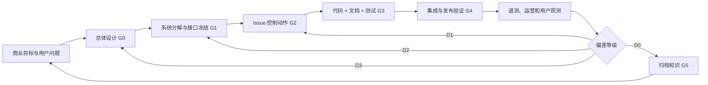

# 钱学森 Skills：VisePanda 软件系统工程方法

Status: active
Repository id: `qian-systems-engineering`
Applies to: product, architecture, code, data, AI, operations, commercial, brand, and marketing work

“钱学森 Skills”是 VisePanda 的永久工程工作流。它把总体目标、模块分解、接口、执行、
观测、反馈、纠偏和知识归档连接成一个可审查的闭环。它与现有文档即代码机制结合，
保留当前 Fable-5 架构和已经接受的项目规则，不另造一套平行管理体系。

## 研究范围与边界

本文依据可访问的图书目录、原始论文记录及高校、科研机构的专题资料进行软件工程适配，
不声称是三部著作的逐章注释或完整复刻。1954 年《Engineering Cybernetics》的公开书目
显示其核心内容包括反馈伺服、稳定性、扰动、非线性和优化控制；1978 年系统工程文章及
后续论文把系统工程用于组织管理；1990 年钱学森、于景元、戴汝为提出开放复杂巨系统和
从定性到定量综合集成方法。本文只提取可用于软件项目的工程原则，以下“软件映射”属于
VisePanda 的方法设计，而非原著原句。

主要依据：

- [Engineering Cybernetics, McGraw-Hill, 1954](https://books.google.com/books/about/Engineering_Cybernetics.html?id=NfgvAAAAIAAJ)
- [教育部：钱学森的科学思想与科学成就](https://www.moe.gov.cn/jyb_xwfb/xw_zt/moe_357/s5129/s6118/s6123/200910/t20091031_127809.html)
- [钱学森图书馆：系统工程思想与 1978 年文章](https://www.qianxslib.sjtu.edu.cn/research/research04_details.php?articleid=83)
- [《一个科学新领域——开放的复杂巨系统及其方法论》论文记录](https://cnki.istiz.org.cn/kcms/detail/detail.aspx?dbcode=CPFD&dbname=cpfd1999&filename=ZGXC199008001001)
- [戴汝为：从定性到定量的综合集成法的形成与现代发展](https://www.nature.shu.edu.cn/CN/Y2009/V31/I6/311)
- [光明日报：忆念钱学森创建系统学](https://www.gmw.cn/01gmrb/2009-12/01/content_1014505.htm)
- [《创建系统学》馆藏说明](https://jp.tfswufe.edu.cn/opac/book/efb8ebdcc0b63c656e7e307a8c278cdb)

---

## 第一部分：三部著作核心方法论摘要（软件适配版）

### 1.1 《论系统工程》：先设计整体关系，再优化局部

适用于软件项目的原则：

1. **总体目标优先。** 局部模块的“完成”不等于系统成功。每项工作必须能追溯到用户结果、
   商业目标或风险控制目标。
2. **总体设计部。** 复杂项目需要一个跨产品、架构、数据、运营和商业边界的统筹职能，负责
   总体方案、接口协调、集成验收和偏差处置，而不是替代各模块负责人编码。
3. **层级分解。** 系统按“产品使命 → 能力链路 → 子系统 → 模块 → 接口 → Issue”逐层分解；
   下层任务必须保留上层目标与约束。
4. **先接口后并行。** 多 Agent 并行工作的前提是输入、输出、不变量和所有权已明确；否则并行
   只会放大返工。
5. **全生命周期。** 设计、开发、部署、运营、复盘和退役属于同一个工程对象；可部署但不可观测、
   不可回滚或无人维护的功能不算完成。

VisePanda 的“总体设计部”不是新增管理层，而是一个职责组合：操作者拥有商业目标，架构维护者
拥有总体设计和接口基线，模块执行 Agent 拥有局部实现，测试/运营证据共同参与验收。小团队中
同一人可兼任多个角色，但角色责任不得消失。

### 1.2 《工程控制论》：用反馈控制偏差，不靠一次性计划

把软件迭代表示为最小控制回路：

```text
目标 r(t) → 计划/Issue → 实现对象 → 观测 y(t)
   ↑                              ↓
   └──── 控制动作 u(t) ← 偏差 e(t)=r(t)-y(t)
                    ↑
                外部扰动 d(t)
```

- `r(t)`：接受的产品、商业、可靠性或合规目标。
- `y(t)`：测试、遥测、成本、转化、用户反馈和运营事实。
- `e(t)`：目标与事实之间的可描述偏差。
- `u(t)`：Issue、回滚、feature flag、运行手册动作、约束修订或 ADR。
- `d(t)`：模型供应商变化、政策、第三方 API、流量、市场和团队容量变化。

由此得到六条软件规则：

1. 没有观测量的目标不可控，必须先定义证据来源。
2. 反馈必须及时；测试在 PR 内反馈，生产指标按约定节拍反馈，不能等季度复盘才发现漂移。
3. 控制动作要小而可逆；优先小 PR、flag、回滚和局部适配，避免用大重构纠正小偏差。
4. 防止振荡；同一指标在观察窗口未结束前不得反复改方向。
5. 区分噪声与趋势；单次用户意见记录为 observation，重复模式才进入正式 deviation。
6. 当控制模型本身错误时，不能继续“调参数”，应通过 ADR 修正目标、边界或架构。

### 1.3 《创建系统学》：复杂问题需要人机结合的综合集成

VisePanda 同时受旅行场景、AI 不确定性、合作伙伴、支付、政策、运营和用户信任影响，不能只靠
单一指标或单个模型判断。适配后的“从定性到定量综合集成”流程是：

1. **定性假设。** 产品、领域和运营人员提出问题边界、因果假设与风险。
2. **异质证据。** 收集用户访谈、代码事实、日志、测试、成本、漏斗、竞品与法规资料。
3. **模型化。** 把证据转成 schema、状态机、指标、实验或可运行原型。
4. **计算与对抗。** 用自动测试、查询、评估集及不同 AI 视角寻找反例；AI 是辅助分析者，
   不是投票裁判。
5. **综合判断。** 由责任人记录选择、置信度、反对意见和未知项。
6. **小步试验。** 通过可回滚的实现取得新观测。
7. **循环逼近。** 比较结果与目标，更新事实、模型或方案，直到满足生命周期门禁。

综合集成的产物必须落在仓库中：Issue、ADR、schema、测试、评估集、分析查询、运行手册或复盘。
只在聊天中讨论、没有责任人和证据的“多模型共识”不构成工程决策。

### 1.4 六项统一原则

| 原则 | 软件工程落点 | 最小证据 |
| --- | --- | --- |
| 总体设计 | 总体设计基线、目标树、子系统边界 | `top-level-design.md` |
| 层级分解 | 目标 → 能力 → 模块 → 接口 → Issue | Issue 的目标与依赖字段 |
| 闭环反馈 | 目标、观测、偏差、动作、复验 | 测试/遥测/复盘记录 |
| 综合集成 | 人、数据、工具、AI 的可追溯综合判断 | ADR 或评审记录 |
| 全生命周期 | 构建、上线、运行、回滚、退役同域设计 | runbook + rollback |
| 偏差修正 | 按等级处理局部偏差或基线错误 | Issue/ADR/rollback |

---

## 第二部分：现有 VisePanda 工作流短板分析

### 2.1 已有基础

项目已经具备正确方向：冻结的 V2 产品架构、TypeScript monorepo、schema-first domain、模块化
单体、TripPatch 不变量、ADRs、GitHub Issue/PR、测试与 AI evals。缺陷不是“没有规划”，而是这些
资产尚未形成强制闭环。

### 2.2 主要漏洞

| 短板 | 现象 | 系统后果 | 钱学森 Skills 修正 |
| --- | --- | --- | --- |
| 总体设计与日常 Issue 脱节 | Issue 可描述局部 UI，却不说明服务哪个目标 | 局部交付增多，商业闭环仍断裂 | Issue 强制填写目标、子系统、观测量 |
| 文档同步依赖自觉 | 代码可合并而架构/模块说明不变 | 知识库逐渐失真，Agent 重复探索 | manifest + docs impact CI |
| 接口冻结不明确 | schema、router、event 可能在消费方 PR 中顺手改 | 多 Agent 并行冲突、返工 | 接口变更独立审查，显式 baseline |
| “完成”偏向代码完成 | mock、memory adapter、placeholder UI 容易被当作已上线 | 规划与真实成熟度混淆 | module docs 标注 implemented/gap；生命周期门禁 |
| 缺少偏差分级 | 所有问题都变成普通 bug 或临时指令 | 小问题过度设计，大问题局部打补丁 | D0-D3 偏差机制 |
| 反馈未闭环 | 测试有结果，但商业漏斗和运营反馈无固定复盘 | 功能上线后不知道是否有效 | 定义观测、节拍、owner、控制动作 |
| AI 协作缺少证据包 | Agent 可只凭上下文作决定 | token 浪费、事实漂移、重复阅读 | 最小上下文包 + 文档索引 + evidence-first |
| 决策与计划混用 | 规划文档可能被误读为当前实现 | 实际架构判断错误 | 文档类型、状态、真理层级 |

### 2.3 当前最高风险偏差

1. **产品成熟度偏差：** Web 已有可展示页面，但多个 server 能力仍是 deterministic、memory 或
   placeholder；必须在文档与 UI 中诚实标注。
2. **商业闭环偏差：** outbound、Human Task、支付和运营证据尚未形成生产级闭环，不能因页面存在
   就宣称收入路径已完成。
3. **权限偏差：** Ops 能力在生产前必须补齐身份认证、角色授权与审计。
4. **部署偏差：** 本地工作区状态、Vercel 设置、Supabase migration 和生产环境之间需要可重复
   runbook，而不能依赖操作者记忆。

---

## 第三部分：优化后的标准化软件工程工作流

### 3.1 顶层设计阶段

**输入：** 商业目标、用户问题、运营事实、法规/技术约束。
**动作：** 明确系统边界、反目标、目标树、控制量、生命周期门禁和责任人。
**产物：** 冻结产品基线、[总体设计基线](../architecture/top-level-design.md)、必要 ADR。
**Gate G0：** 目标可测，范围与反目标明确，未知项被记录；否则不得拆任务。

### 3.2 系统拆解与接口冻结阶段

按以下层级向下分解：

```text
商业结果
  └─ 用户能力链路
      └─ 子系统（Copilot / Trip / Knowledge / Commerce / Identity / Telemetry）
          └─ 模块（domain / server / web / ops / mobile）
              └─ 接口基线（schema / router / event / migration / route）
                  └─ GitHub Issue
```

每个接口基线必须说明 owner、输入、输出、错误、幂等性、权限、版本和消费者。破坏性变更必须先用
独立 domain/contract PR 冻结，再让消费者并行开发。

**Gate G1：** 模块边界无循环所有权，接口可测试，风险和回滚路径存在。

### 3.3 Issue 任务拆分阶段

一个 Issue 是一个可独立验证的控制动作，必须包含：

- 上层目标和预期用户/商业结果；
- 所属子系统、当前观测和要纠正的偏差；
- scope、do-not-touch、接口影响与文档影响；
- 依赖关系、风险、回滚；
- 可执行验收与观测指标；
- 预估工作范围：`XS`（≤0.5 天）、`S`（≤1 天）、`M`（≤3 天）、`L`（≤5 天）；大于 L 必须再拆。

**Gate G2：** Issue 可由不了解聊天历史的 Agent 单独执行；否则不可认领。

### 3.4 编码开发阶段（代码与文档同步）

1. Agent 读取 `AGENTS.md`、`CONTEXT.md`、文档索引、总体设计、模块文档、约束和 Issue。
2. 先建立最小证据：复现、契约测试或失败测试；新功能建立 acceptance test。
3. 按模块所有权实现，不跨表、不复制 schema、不绕过 TripPatch、权限或商业网关。
4. 同一 PR 更新最小相关文档。代码变更而文档不变视为未完成。
5. 记录假设和实际差异；遇到 D2/D3 偏差先停止扩大实现并升级评审。

**Gate G3：** 实现、测试、文档和回滚计划同时存在。

### 3.5 测试、反馈与偏差校验阶段

PR 的反馈层次从快到慢：

1. schema/单元测试；
2. 模块契约与集成测试；
3. build、lint、typecheck；
4. AI evals、数据 migration contract；
5. 浏览器/设备场景验收；
6. staging smoke test；
7. 生产遥测与运营复核。

偏差等级：

| 等级 | 定义 | 动作 |
| --- | --- | --- |
| D0 | 在已接受容差内 | 记录 observation，无需改动 |
| D1 | 单模块、可逆、接口不变 | 当前 PR 或小 Issue 修正 |
| D2 | 跨模块、接口/权限/商业规则变化 | 暂停扩散，设计评审 + ADR/contract PR |
| D3 | 目标、产品定位或总体架构假设失效 | 操作者决策，修订冻结基线和路线图 |

**Gate G4：** 所有验收证据可复现；未验证项明确标记，不能用推测代替结果。

### 3.6 复盘迭代阶段

合并不是闭环终点。达到观测窗口后必须回答：

- 目标是否达成，证据是什么？
- 出现了什么非预期副作用或新知识缺口？
- 这是噪声、D1、D2 还是 D3？
- 继续、调整、回滚还是退役？
- 哪份说明、约束、runbook、eval 或 Issue 模板需要更新？

PR 级复盘随合并完成；发布级复盘在 smoke test 后；产品/商业指标按总体设计中约定的节拍复盘。

### 3.7 版本归档与知识库更新

- ADR append-only；旧决策用 superseded 标记，不改写历史。
- 规划/调研加日期和状态，过期后转 `historical`。
- release 记录变更、migration、flag、回滚点和已知偏差。
- 已解决的知识缺口关联到 fact、guide、测试或 runbook。
- 删除代码时同步删除或更新模块说明、索引映射与运维步骤。

**Gate G5：** 文档索引新鲜、证据可追溯、下一轮控制动作已进入 Issue 或明确为无需动作。

### 3.8 完整闭环



---

## 第四部分：文档管理更新规范（Matt Pocock 模式 + 钱学森系统工程）

### 4.1 融合原则

本项目借鉴 Matt Pocock 公开仓库中可验证的实践：短而明确的 `AGENTS.md`、共享语言
`CONTEXT.md`、分层 `docs/`、GitHub Issue 作为工作单元，以及自动化检查。它不是名为
“Matt Pocock 标准”的官方规范。钱学森 Skills 在此基础上增加总体设计、控制量、偏差分级、
生命周期门禁和综合集成复盘。

可核对的公开实践包括 [mattpocock/sandcastle](https://github.com/mattpocock/sandcastle)、
[mattpocock/skills](https://github.com/mattpocock/skills) 与
[AGENTS.md 开放格式](https://agents.md/)。

### 4.2 Index 规则

1. `docs/manifest.json` 是文档注册表，记录类型、状态、owner、摘要和代码映射。
2. `docs/handoff.json` 记录当前阶段、活跃工作、阻塞、验证证据、下一动作和阅读顺序；每次仓库
   变更必须同步。
3. `docs/INDEX.md` 自动生成，先展示接手快照与强制阅读顺序，禁止手工修改。
4. 所有受控 Markdown 必须登记；孤儿文档、断链、重复路径和陈旧索引阻止合并。
5. Index 按“先接手状态、再权威基线、后解释；先当前、后历史”导航，不按文件创建时间堆叠。
6. 每个模块必须可从 Index 到达总体设计、模块说明、约束和运行手册。

### 4.3 代码动 → 文档必动

| 代码或配置变化 | 至少同步更新 |
| --- | --- |
| `packages/domain` schema/纯函数 | domain 模块、API contract；必要时 ADR/constraint |
| `apps/server` router/service/adapter | server 模块、runtime flow；接口变更更新 contract |
| `apps/web` / `apps/ops` / `apps/mobile` | 对应 surface 模块和用户/运营流程 |
| migrations/RLS | data platform、permission constraint、migration runbook |
| AI prompt/model/router | AI 模块、eval README/用例、成本或部署约束 |
| payment/outbound/Human Task | business constraint、commercial 文档、runbook |
| CI/deploy/env | deployment constraint、相关 runbook |
| brand/copy/navigation | canonical design doc、surface 模块；重大方向用 ADR |

`pnpm docs:impact -- --base <ref>` 校验映射。生成的 Index 不能单独满足“文档已更新”。
任何代码、配置或文档变更还必须同步 `docs/handoff.json`，确保下一位接手者看到的是合并后的
事实，而不是上一轮计划。

### 4.4 修订、变更、复盘、归档

1. **修订：** 改代码时更新描述当前事实的文档。
2. **变更：** 改约束或方向时先写 ADR，再更新约束与总体设计。
3. **复盘：** 用观测纠正假设；结论进入文档或 Issue，不只留在聊天/会议。
4. **归档：** 规划和研究保留历史状态；当前说明不得继续链接到已废弃步骤。
5. **审计：** PR 模板列出文档影响与偏差等级；reviewer 同时检查事实与规则。

### 4.5 AI Coding Agent 最小上下文包

每个 Agent 在编码前只需读取：

1. `AGENTS.md`；
2. `CONTEXT.md`；
3. `docs/INDEX.md` 中与任务相关的路线；
4. 总体设计基线中的目标/子系统；
5. 相关模块、约束、ADR、runbook；
6. 当前 GitHub Issue 和真实 git 状态。

这减少重复全仓扫描和 API token 消耗，同时保持目标、边界和证据完整。

---

## 第五部分：约束条款

完整、规范性的条款位于
[钱学森 Skills 约束](../constraints/qian-systems-engineering.md)。以下为不可豁免的核心：

1. 所有开发必须追溯到已接受的总体目标和 GitHub Issue。
2. 跨模块开发前必须冻结接口；不允许边写消费者边隐式改契约。
3. AI、人员或工具的结论必须有可检查证据；多数模型同意不等于事实。
4. 代码、文档、测试和回滚方案属于同一个交付物。
5. 任何事实偏差必须分级；D2/D3 不得以局部补丁绕过评审。
6. 生产发布必须可观测、可回滚；无 owner 的运行能力不得上线。
7. 商业化、权限、隐私、TripPatch 和知识真实性不变量不得因排期而放宽。
8. 每轮迭代必须完成目标对比和知识归档；合并代码不等于关闭系统回路。

违反自动校验条款时 CI 直接失败；违反语义条款时 reviewer 必须拒绝合并。紧急修复允许先恢复
服务，但必须在 24 小时内补 Issue、证据、文档和复盘，不得把“紧急”变成永久豁免。
